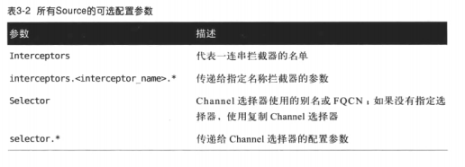

##Source
1. 定义：从其他产生数据的应用中接收数据的活跃组件；
2. **每一个Source至少连接一个Channel**；一个Source可以写入几个Channel，**复制事件到所有或者某些Channel中**；

###生命周期
当启动一个agent时，配置系统会按配置自动启动Source，只有agent自身停止或者被杀死，被重新配置，Source才停止；**每一个Source都是无状态的**，即agent如果被重启或者重新配置，则之前的Source实例会销毁不能重用；

###Source配置信息
1. 必须配置的属性：type：Source的类型；channels：当有多个channel时，**用空格分隔**；Source通过选择器选择channel，病案配置文件中的顺序将事件写入到channel中；
如：
```
    agent1.sources = userSource
    agent1.channels = memory
    agent1.sources.userSource.type = avro
    agent1.sources.userSource.channels = memory
```
2. 可选参数列表：

    >拦截器是相对特殊的属性，可以对不同的拦截器进行进一步参数的设置，有多个拦截器时，**之间用空格分隔开来**；如：
    ```
    //设置两个拦截器i1和i2
    agent1.sources.userSource.Interceptors = i1 i2   //空格分隔
    agent1.sources.userSource.Interceptors.i1.type = host
    ```
    >**Source中设置Channel选择器selector（不用加s）**